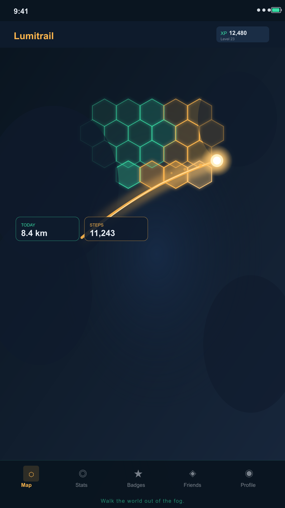
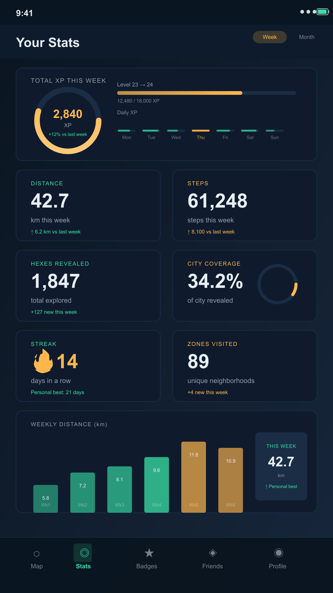
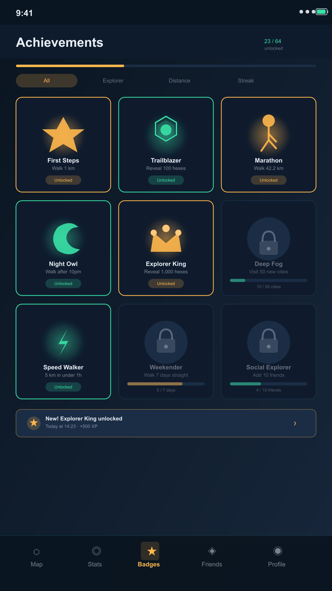
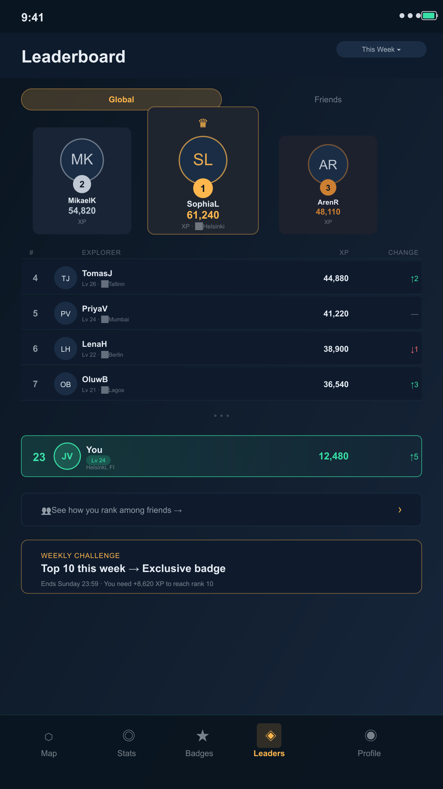

# Lumitrail

> **Walk the world out of the fog.**

Lumitrail is a free, cross-platform **fog-of-war real-world exploration game**.
Your entire world map starts hidden under fog. Physically walking or travelling
to a place permanently **unfogs** it. Chase 100% completion of regions and
countries, earn XP, level up, unlock achievements, climb leaderboards, and
compare your map with friends — think the exploration/levelling/social loop of
Strava + Pokémon GO, applied to uncovering a personal map of the world.

Built from scratch to decisively beat the buggy, battery-hungry originals on
**battery efficiency, reliability, polish, and features** — and it's **100%
free**: all social and leaderboard features are open to everyone, with no
paywalls, no premium tier, and no ads in the core experience.

<p align="center">
  
  
  
  
</p>

---

## Features

- 🌫️ **Fog-of-war on a real map** — a real interactive street map (Google/Apple
  Maps) starts fully fogged; the fog is a dark overlay with a hole punched for
  every explored H3 cell, so walking reveals the real streets beneath.
- 🧭 **Exploration %** — per-region / per-country / worldwide completion, with a
  100% completionist goal.
- ✨ **XP & levels** — earn XP for new areas, distance, and daily streaks; level
  up on a satisfying curve.
- 🏅 **Achievements** — 18 badges across discovery, distance, world, streak, and
  progression tiers (bronze → platinum).
- 📊 **Stats dashboard** — distance, areas discovered, streaks, active days, and
  an exploration timeline.
- 🏆 **Leaderboards** — global and friends-only, on multiple metrics.
- 👥 **Social** — friend requests, compare exploration, and shareable snapshots.
- 📴 **Offline-first** — tracking and reveal work with zero connectivity; opt-in
  sync merges devices conflict-free.
- 🔋 **Battery-safe** — OS geofence-wake + batched/deferred background updates,
  never continuous high-frequency GPS.
- 🔒 **Privacy-first** — location stays on your device; granular sharing opt-ins;
  full data export and delete.

## Why it's better than the originals

|                        | **Lumitrail**                                    | Fog of World                 | Wandrer                   |
| ---------------------- | ------------------------------------------------ | ---------------------------- | ------------------------- |
| Price                  | **Free**                                         | $30–40 one-time              | $40/yr (free tier capped) |
| Platforms              | **Android + iOS**                                | iOS/Android/macOS            | Web-first                 |
| Battery                | **Geofence-wake, batched, balanced accuracy**    | 5–10%/hr reported            | n/a (web)                 |
| Background reliability | **Fixes queued + replayed; never silently lost** | Silently stops               | n/a                       |
| Social / leaderboards  | **Built in, open to all**                        | None                         | Limited                   |
| Offline                | **Fully offline-first**                          | Partial                      | No                        |
| Sync                   | **Conflict-free (G-Set CRDT)**                   | iCloud/Drive (crash reports) | Server-side               |

---

## Quick start

### Prerequisites

- **Node 20+** (developed on Node 25) and npm.
- The real map (`react-native-maps`) and battery-safe background location both
  need **native code**, so the app runs in a **development build, not Expo Go**:
  - **Android:** Android Studio + Android SDK, and a **free Google Maps API key**
    (steps below). Android 14+ also needs `FOREGROUND_SERVICE_LOCATION` — already
    configured.
  - **iOS:** Xcode + CocoaPods (`sudo gem install cocoapods` or
    `brew install cocoapods`). iOS uses **Apple Maps**, so **no API key** is
    needed.

### Install

```bash
npm install
```

### See the whole game loop in your terminal (no device needed)

```bash
npm run demo
```

This drives the real domain and data code with a scripted walk (Stockholm →
London) and narrates: **move → unfog → gain XP → level up → achievement →
leaderboard → offline-first sync**.

### Run the app (development build)

Because the map needs native code, use a development build rather than Expo Go.
These commands prebuild the native project and install it on a connected
device/emulator:

```bash
npx expo run:android   # builds & installs the Android dev build (needs the Google Maps key)
npx expo run:ios       # builds & installs the iOS dev build (Apple Maps, no key)
```

After the first build, iterate quickly with the Metro bundler:

```bash
npm start              # then press a / i to open the installed dev build
```

The app initialises the real device stack (GPS + SQLite) when available and
falls back to a safe **in-memory demo mode** otherwise, so you can always press
**"Demo walk"** to reveal fog immediately even without a live GPS fix. On open it
centres on your current location and shows the **% uncovered** HUD.

### Google Maps API key (Android only)

Android renders the basemap with Google Maps, which needs a free key. iOS uses
Apple Maps and needs no key, so you can skip this if you only run on iOS.

1. Go to the **Google Cloud Console** → <https://console.cloud.google.com/>.
2. Create a project (top bar → project dropdown → **New Project** → name it
   e.g. `lumitrail` → **Create**).
3. In the left menu open **APIs & Services → Library**, search for **“Maps SDK
   for Android”**, open it, and click **Enable**.
4. Open **APIs & Services → Credentials → Create credentials → API key**. Copy
   the key it shows.
5. (Recommended) Click the new key → **Restrict key** → under _API restrictions_
   choose **Maps SDK for Android**, and under _Application restrictions_ choose
   **Android apps** and add package name `app.lumitrail`. Save.
6. In the project root, copy the example env file and paste your key:
   ```bash
   cp .env.example .env
   # then edit .env and set:
   # GOOGLE_MAPS_API_KEY=AIza...your-key...
   ```
7. Rebuild: `npx expo run:android`. The key is injected at build time by
   `app.config.js`; it is **never committed** (`.env` is git-ignored) and never
   hardcoded. Google Maps has a generous always-free tier for mobile map loads.

> If you see a **blank/grey map** on Android, the key is missing, not enabled for
> “Maps SDK for Android”, or the app wasn't rebuilt after setting `.env`.

### Quality gate (what CI runs)

```bash
npm run typecheck    # tsc --noEmit
npm run lint         # eslint (flat config)
npm run format:check # prettier
npm test             # jest — 108 tests across 19 suites
```

---

## Project structure

```
src/
├── domain/        Pure game logic (no RN/Expo) — the fog engine & core loop
├── data/          Location provider, SQLite persistence, sync (+ in-memory fakes)
├── app/           ExplorationService, Zustand store, theme tokens
├── presentation/  Screens & components (React Native + SVG)
└── config/        Tunable game constants
scripts/demo.ts    Headless end-to-end demo
assets/            Icons, adaptive icon set + densities, store assets
brand/             SVG sources for all brand assets
```

The domain and data layers deliberately avoid React Native imports so the entire
game loop is verifiable headless under `jest`. See **[ARCHITECTURE.md](ARCHITECTURE.md)**
for the full design, the H3 fog-storage strategy, and the battery model.

## Tech stack

- **Expo SDK 57** · React Native 0.86 · React 19.2 · **TypeScript** (strict)
- **react-native-maps** real basemap (Google/Apple) with a Polygon-with-holes fog overlay
- **Uber H3** (res 9) hexagons for fog · **expo-sqlite** (WAL) persistence
- **expo-location** + **expo-task-manager** for battery-safe background tracking
- **Zustand** state · **react-native-svg** for badges/charts
- **jest** (jest-expo) · **ESLint 9** (flat) · **Prettier**

## Documentation

| Doc                                    | What's in it                                        |
| -------------------------------------- | --------------------------------------------------- |
| [PRODUCT.md](PRODUCT.md)               | Vision, personas, full feature list, roadmap        |
| [ARCHITECTURE.md](ARCHITECTURE.md)     | Stack rationale, layers, fog storage, battery, sync |
| [BRAND.md](BRAND.md)                   | Name, palette, typography, icon, voice              |
| [PRIVACY_POLICY.md](PRIVACY_POLICY.md) | Privacy policy + Play Data Safety declaration       |
| [STORE_LISTING.md](STORE_LISTING.md)   | Play Store submission package                       |
| [CONTRIBUTING.md](CONTRIBUTING.md)     | Setup, standards, testing, workflow                 |
| [CHANGELOG.md](CHANGELOG.md)           | Release history                                     |

## License

See [LICENSE](LICENSE).
